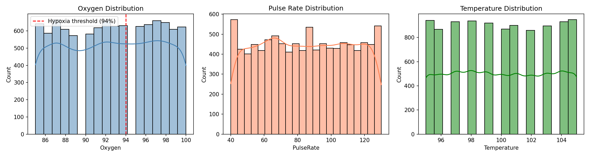
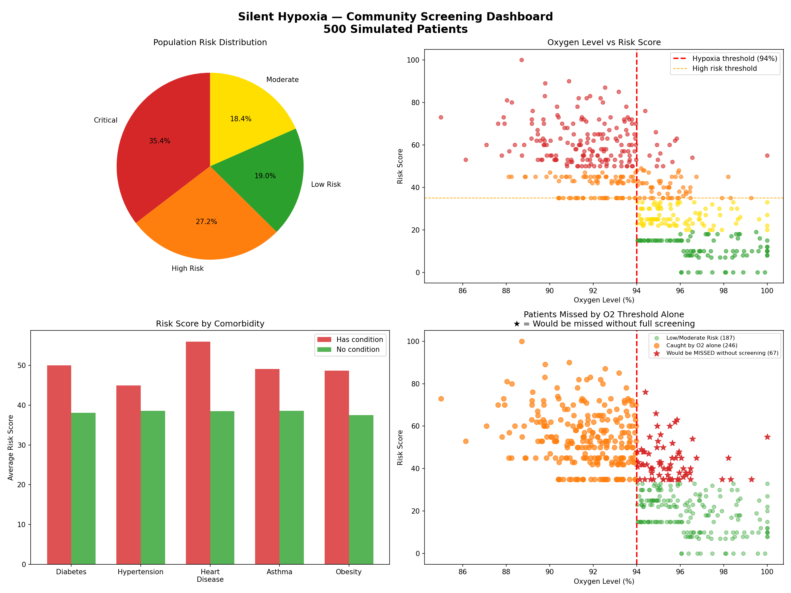
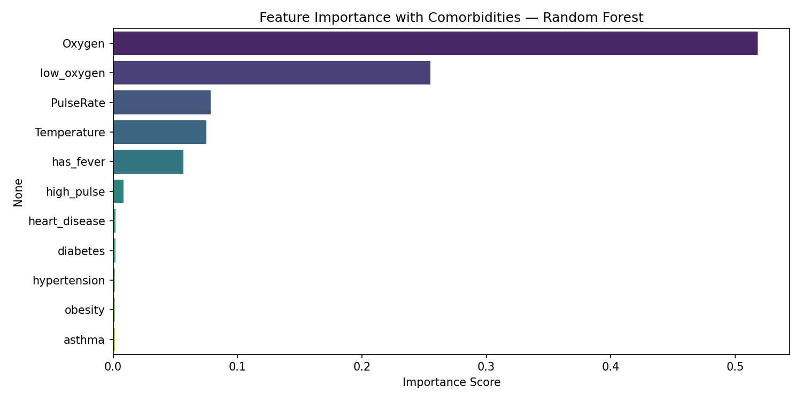
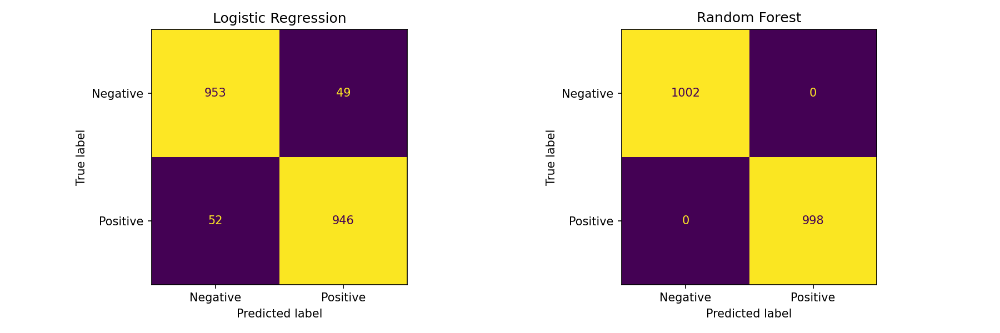

# Silent Hypoxia Early Detection System
AI-based early detection of silent hypoxia in COVID-19 patients using Machine Learning and community screening.

## Key Finding
Standard oxygen checks alone miss 13.4% of high-risk patients — people who feel completely fine but are silently deteriorating.This system caught them by combining vitals, comorbidities and symptoms.

## What is Silent Hypoxia?
A dangerous condition where blood oxygen drops critically low WITHOUT causing breathlessness. Patients feel fine while their organs are starved of oxygen. Gained widespread attention during COVID-19 pandemic.

## Dataset
- Source: Kaggle — COVID-19 Temperature/Oxygen/Pulse Rate
- 10,002 patient records
- Features: SpO2, Pulse Rate, Temperature, Result

## What This System Does
1. Detects silent hypoxia using ML models
2. Assesses risk using 11 clinical features
3. Monitors patients continuously over time
4. Screens community members who never visit hospital
5. Flags patients missed by oxygen threshold alone

## Results
| Model | Accuracy |
|-------|----------|
| Logistic Regression | 95% |
| Random Forest | 100% |

## Community Screening Results (500 patients)
| Risk Level | Count | Percentage |
|------------|------|-------------|
| Critical | 177 | 35.4% |
| High Risk | 136 | 27.2% |
| Moderate | 92 | 18.4% |
| Low Risk | 95 | 19.0% |

Patients missed by O2 threshold alone: **67 (13.4%)**

## Features Used
- Oxygen saturation (SpO2)
- Pulse rate
- Temperature
- Low oxygen flag (SpO2 < 94%)
- High pulse flag (> 100 bpm)
- Fever flag (> 100.4F)
- Diabetes
- Hypertension
- Heart disease
- Asthma
- Obesity

## Key Visualizations

## Tech Stack
Python, Pandas, Scikit-learn, Matplotlib, Seaborn,
Jupyter Notebook

## Clinical Significance
- 1 in 8 at-risk patients would be missed without full screening
- System combines ML predictions with clinical rule-based scoring
- Designed for both hospital and community deployment
- Accessible screening using just a Rs.500 pulse oximeter
  
## Limitations & Honest Assessment
- Spot-check monitoring cannot catch rapid deterioration between readings
- Comorbidity data was synthetically generated,real clinical data would show stronger correlations
- System designed for early detection, not replacement of clinical care
- High risk patients should be escalated to continuous hospital monitoring

## Mitigation Strategy
- Risk-adaptive check intervals (high risk = more frequent)
- Symptom education between readings
- Caregiver alert system for vulnerable patients
- Clear escalation pathway to emergency care
